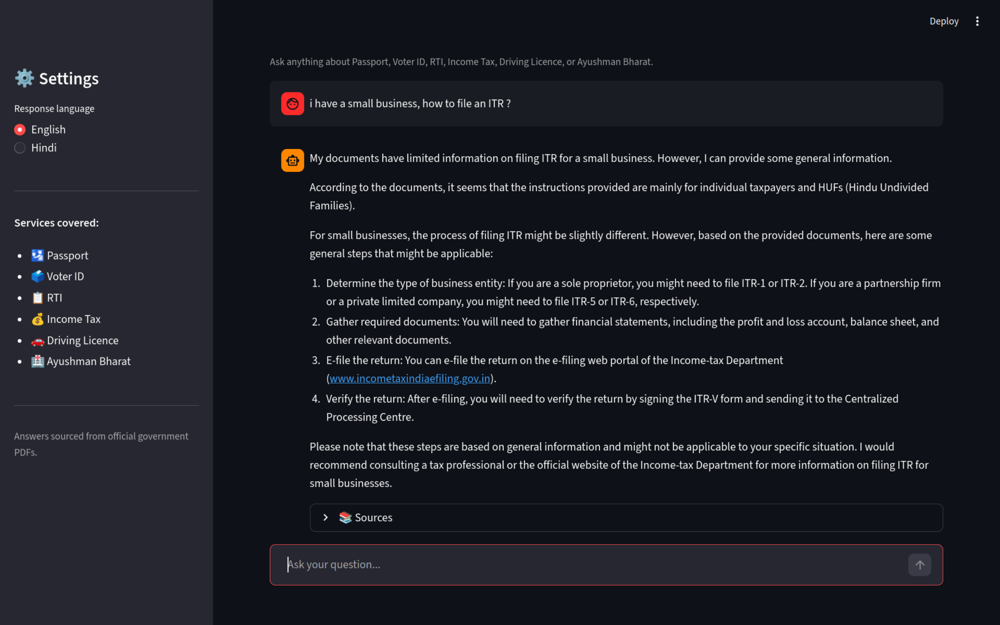

# Indian Government Services RAG Chatbot

A Retrieval-Augmented Generation (RAG) chatbot that answers questions about Indian government services using official PDF documents as the source of truth.

The system retrieves relevant document chunks first, then generates responses grounded in those chunks to reduce hallucinations and improve reliability.

## Demo



## Highlights

- End-to-end RAG pipeline with modular components
- Semantic retrieval over PDF content using dense embeddings
- Cached indexing for faster subsequent startups
- Streamlit chat interface with source excerpts and relevance scores
- English and Hindi response support

## Supported Domains

- Passport
- Voter ID
- RTI
- Income Tax
- Driving Licence
- Ayushman Bharat

## System Architecture

```text
User Query
   -> Query Embedding (sentence-transformers)
   -> Cosine Similarity Retrieval (NumPy)
   -> Top-k Document Chunks
   -> LLM Response Generation (Groq)
   -> Answer + Source Evidence
```

## Repository Structure

```text
.
├── app.py
├── README.md
├── requirements.txt
├── project_description.md
├── test_script.py
├── data/
│   └── pdfs/
├── src/
│   ├── embedder.py
│   ├── llm_client.py
│   ├── pdf_loader.py
│   └── retriever.py
└── tests/
    ├── test_pdf_loader.py
    └── test_retriever.py
```

## How It Works

1. PDF ingestion: Documents are read from `data/pdfs`.
2. Chunking: Text is split into manageable sentence-based chunks.
3. Embedding: Chunks are converted to vectors using `all-MiniLM-L6-v2`.
4. Caching: Embeddings are stored in `data/embedded_data.pkl` for reuse.
5. Retrieval: Top-k chunks are selected via cosine similarity.
6. Generation: The LLM answers using retrieved context and avoids unsupported claims.

## Tech Stack

- Python
- Streamlit
- pypdf
- sentence-transformers
- NumPy
- python-dotenv
- Groq API (LLM inference)
- pytest

## Setup

### 1. Clone and enter the project

```bash
git clone <your-repo-url>
cd RAG-chatbot
```

### 2. Create a virtual environment

```bash
python3 -m venv .venv
source .venv/bin/activate
```

### 3. Install dependencies

```bash
pip install -r requirements.txt
```

### 4. Configure environment variables

Create a `.env` file in the project root:

```env
GROQ_API_KEY=your_groq_api_key
```

### 5. Add source PDFs

Place your government service PDFs in `data/pdfs/`.

### 6. Run the app

```bash
streamlit run app.py
```

On first launch, document embeddings are generated and cached. Later launches reuse the cache for faster startup.

## Example Questions

- How do I apply for a fresh passport in India?
- What documents are required for voter ID registration?
- What is the process to file an RTI request?
- How can I file ITR-1?

## Testing

```bash
pytest -v
```

## Current Limitations

- Retrieval currently uses in-memory similarity search (suitable for small to medium corpora).
- Document updates require re-indexing (delete `data/embedded_data.pkl` to rebuild).
- Tests are currently scaffolded and can be expanded with stronger coverage.

## Roadmap

- Add a vector database backend (FAISS/Chroma) for larger corpora
- Add retrieval metrics (Recall@K, MRR)
- Improve citation formatting and source linking
- Add automated evaluation and regression checks
- Package as a deployable app with environment templates

## Author

Divyanshu Jain

GitHub: https://github.com/D1vyanshu1
